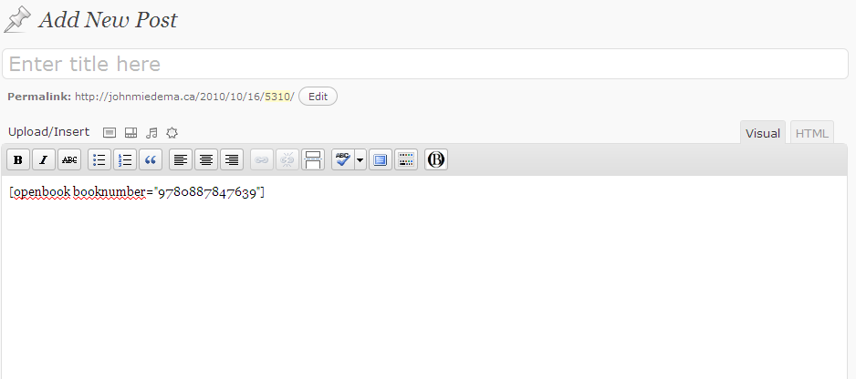
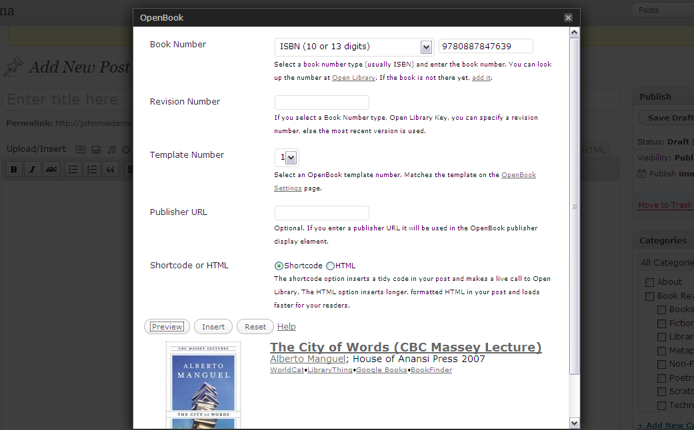
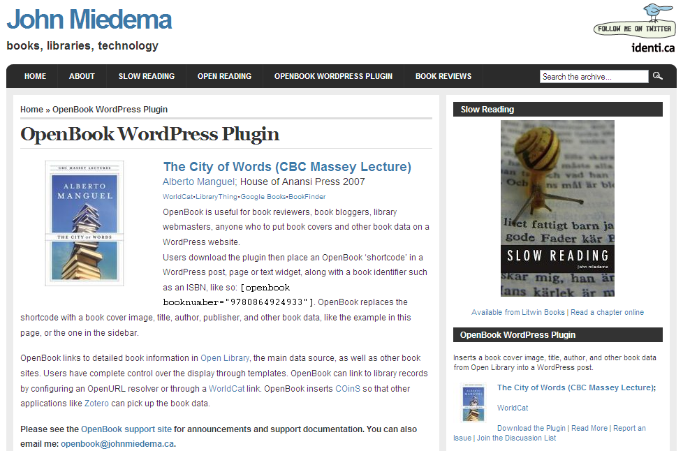
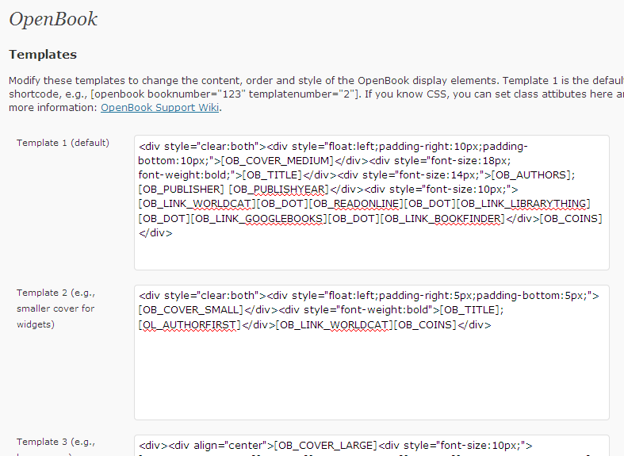

# OpenBook

**Contributors:** johnmiedema, goulu  
**Tags:** book, books, reading, library, book covers  
**Requires at least:** 6.3.0  
**Requires PHP:** 7.0  
**Tested up to:** 7.0  
**Stable tag:** 3.7.2  
**License:** GPLv2 or later  
**License URI:** https://www.gnu.org/licenses/gpl-2.0.html  

Displays a book's cover image, title, author, links, and other book data from Open Library.

## Description

OpenBook is for book reviewers, book bloggers, library webmasters, anyone who wants to put book covers and data on their WordPress blog or website. 

Use the OpenBook button in the WordPress visual editor or insert an OpenBook 'shortcode' with a book number in a WordPress post, page or widget. OpenBook will display a book cover image, author, and other book data from Open Library (http://openlibrary.org). It also displays links to book websites. Users can control the content through templates and styling through a stylesheet. OpenBook inserts COinS to integrate with applications like Zotero. Librarians can point OpenBook to their library records using an OpenURL resolver. 

### Requirements
To use OpenBook, your server must use PHP 7.0 or higher, and cURL must be enabled. 

### Reference
For more details about OpenBook, see the reference article: [OpenBook: A WordPress Plugin for Book Data](https://journal.code4lib.org/articles/105) published in *The Code4Lib Journal*.

## Installation

Use the plugin menu or the following manual steps:

1. Deactivate any previous version of OpenBook through the 'Plugins' menu in WordPress.
2. Delete any previous version of OpenBook in the `/wp-content/plugins/` directory.
3. Upload the entire openbook folder to the `/wp-content/plugins/` directory.
4. Activate the plugin through the 'Plugins' menu in WordPress.
5. Insert an instance of OpenBook in one of two ways:
   - **Using the Visual Editor:** Click the OpenBook button to open a form for entering a book number and options, then click Preview or Insert.
   - **Using a Shortcode:** In a post, page, or text widget, insert the openbook tags and an ISBN/OLID number, like so: `[openbook booknumber="0864921535"]`.
6. Type your content as usual after the tags.

By default, OpenBook will display a book cover image, title, author, and publisher, along with links to Open Library, WorldCat, and other book sites.

## Frequently Asked Questions

* **Where do I find an ISBN number?**
  You can obtain the ISBN for a book by searching for it in Open Library. It is also usually listed in other common sources of book data, e.g., Amazon.

* **What if the title does not have an ISBN?**
  You can use the Open Library number found in the Open Library URL, e.g., `[openbook booknumber="OL882707M"]` from http://openlibrary.org/b/OL882707M.

* **What if the cover image or other data is missing in Open Library?**
  You can add cover images and other data to Open Library.

* **How do I change the display of OpenBook?**
  Change the content and ordering of display elements using the templates in the Settings panel for OpenBook. Manage the styling by editing the OpenBook stylesheet.

* **How do I point OpenBook to my library?**
  In the OpenBook Settings panel, configure an OpenURL resolver for your library.

* **I don't see the OpenBook button on my Visual Editor toolbar**
  Make sure you have the latest version of OpenBook. In the Visual Editor, click CTRL-F5 to force a refresh. The button will appear.

## Screenshots

1. Insert a book number, e.g., ISBN, using an OpenBook shortcode.
   
2. Or use the OpenBook form to insert a book number and parameters. You can preview the display.
   
3. OpenBook displays book data from Open Library.
   
4. Customize the display using OpenBook's templates.
   

## Changelog

### 3.7.2
* Fully internationalized all plugin strings (PHP and TinyMCE JavaScript editor button UI).
* Added embedded French (fr_FR) translation files.
* Added automatic author name transliteration (romanization) for non-Latin names with original script preserved in brackets (e.g. "Liu Cixin (刘慈欣)").
* Fixed code style validator warnings and cleaned up old test assets.

### 3.7.1
* Fixed GitHub Actions deployment workflow configuration.
* Moved screenshot files to .wordpress-org folder and updated readme.md paths.
* Updated Plugin URI in openbook.php.

### 3.7.0
* Restored the TinyMCE visual editor button and Thickbox modal layout.
* Corrected asset paths (stylesheet and icon) to be dynamic and support folder renaming.
* Moved TinyMCE button filters registration to `admin_init` hook.
* Added standard `Requires PHP` metadata fields.

### 3.6.0
* Updated (by AI) for compatibility with WordPress 6.3-6.8 (php 7.00+)

### 3.5.2
* Updated readme and support labels. Tested compatibility with WordPress 4.8

### 3.5.1
* Compatibility with WordPress 3.9.1
* Fixed OpenBook button issue for WordPress 3.9
* Note: if you don't see the button on the toolbar right away, click CTRL-F5 to force a refresh
* Modified dialog for preview and insert of books
* HTML is the default option

## Upgrade Notice

### 3.7.2
Internationalization update featuring native French translations, automatic romanization of non-Latin author names, and code style cleanups.

### 3.7.1
Minor update fixing deployment workflow and asset paths for WordPress.org SVN repository.

### 3.7.0
This update restores the editor button functionality on modern WordPress versions, resolves asset path loading conflicts, and declares PHP 7.0+ requirements.
